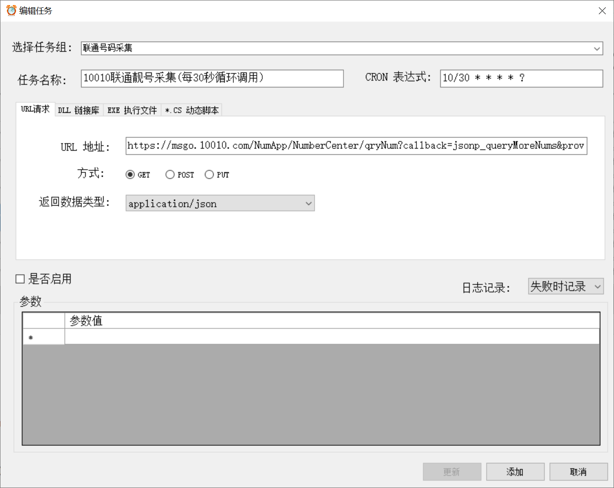
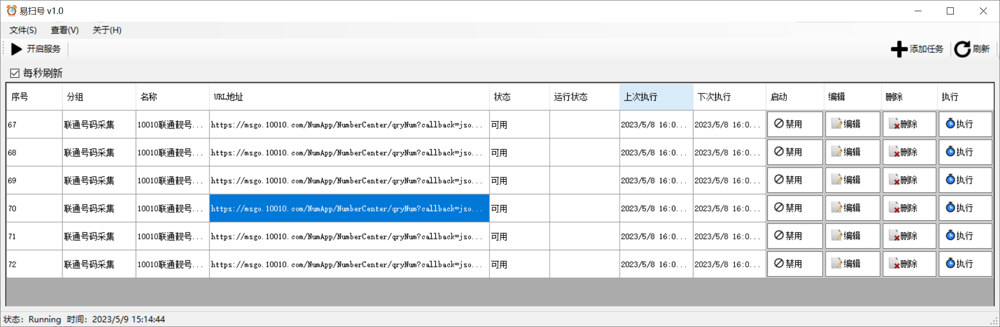
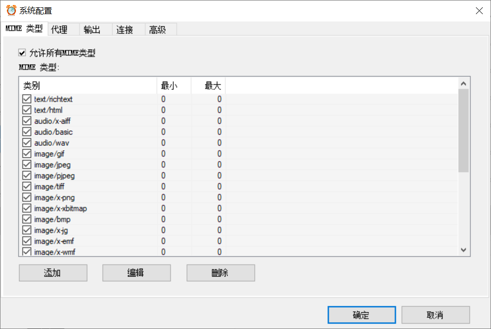
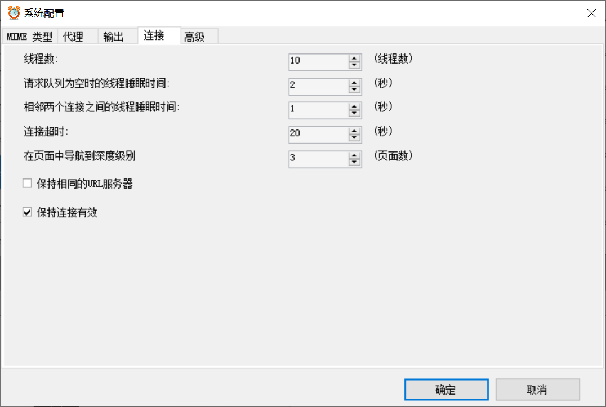
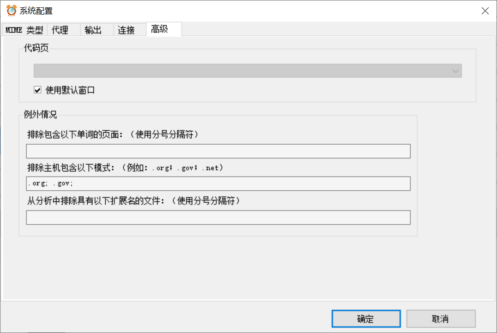

# EasyScan

使用 Winform+Quartz 开发的一套 Windows 桌面运营商，手机靓号采集/爬虫扫描工具

## 项目结构

EasyScan  
├─ EasyScan.DapperExtensions  
│ ├─ Attribute  
│ │ ├─ ColumnAttribute.cs  
│ │ ├─ IgoreAttribute.cs  
│ │ └─ TableAttribute.cs  
│ ├─ Cache  
│ │ ├─ MySqlCache.cs  
│ │ ├─ OracleCache.cs  
│ │ ├─ PostgreCache.cs  
│ │ ├─ SqliteCache.cs  
│ │ └─ SqlServerCache.cs  
│ ├─ Entity  
│ │ ├─ PageEntity.cs  
│ │ └─ TableEntity.cs  
│ ├─ Sqlbuilder  
│ │ ├─ BuilderFactory.cs  
│ │ ├─ ISqlBuilder.cs  
│ │ ├─ MySqlBuilder.cs  
│ │ ├─ OracleBuilder.cs  
│ │ ├─ PostgreBuilder.cs  
│ │ ├─ SqliteBuilder.cs  
│ │ └─ SqlServerBuilder.cs  
│ ├─ Util  
│ │ └─ CommonUtil.cs  
│ ├─ DapperExtension.cs  
│ ├─ DapperExtensionAsync.cs  
│ └─ DapperExtensions.csproj  
├─ EasyScan.DBProviders  
│ ├─ Data  
│ │ ├─ DatabaseProvider.cs  
│ │ ├─ DBBase.cs  
│ │ ├─ MsSqlProvider.cs  
│ │ ├─ MySqlProvider.cs  
│ │ └─ PostgreSqlProvider.cs  
│ ├─ Domain  
│ │ ├─ APIData.cs  
│ │ ├─ BaseEntity.cs  
│ │ ├─ JobInfo.cs  
│ │ └─ PhoneNumber.cs  
│ ├─ RabbitMQ  
│ │ ├─ BusBuilder.cs  
│ │ ├─ Producer.cs  
│ │ └─ RabbitMQHelper.cs  
│ ├─ Service  
│ │ ├─ IMessageSender.cs  
│ │ ├─ IPhoneNumberService.cs  
│ │ ├─ IRequestProvider.cs  
│ │ ├─ ISchdulerService.cs  
│ │ ├─ MessageSender.cs  
│ │ ├─ PhoneNumberService.cs  
│ │ ├─ RequestProvider.cs  
│ │ ├─ SchdulerService.cs  
│ │ └─ SecuritySignHelper.cs  
│ ├─ CommonHelper.cs  
│ └─ EasyScan.Core.csproj  
├─ EasyScan.Manager  
│ ├─ AppCode  
│ │ ├─ Entity  
│ │ │ ├─ ColumnEntity.cs  
│ │ │ ├─ DbTypeEntity.cs  
│ │ │ └─ TableEntity.cs  
│ │ └─ Utils  
│ │ └─ MyUtils.cs  
│ ├─ Common  
│ │ ├─ BrowseForFolder.cs  
│ │ ├─ ComboboxItem.cs  
│ │ ├─ ConvertExtensionMethods.cs  
│ │ ├─ Data.cs  
│ │ ├─ DataTransfer.cs  
│ │ ├─ ISqlHelper.cs  
│ │ ├─ MySqlHelper.cs  
│ │ ├─ RegularExpressions.cs  
│ │ ├─ Settings.cs  
│ │ ├─ SqlServerHelper.cs  
│ │ ├─ UIControlHelper.cs  
│ │ └─ XmlHelper.cs  
│ ├─ Crawler  
│ │ └─ MyWebRequest.cs  
│ ├─ Data  
│ │ └─ DB.xml  
│ ├─ DbHelper  
│ │ ├─ ISqlHelper.cs  
│ │ ├─ MySqlHelper.cs  
│ │ ├─ MySQLManager.cs  
│ │ └─ SqlServerHelper.cs  
│ ├─ Job  
│ │ ├─ FullJob.cs  
│ │ ├─ JoberRunSecHandler.cs  
│ │ ├─ JoberRunSrv.cs  
│ │ ├─ JobHelper.cs  
│ │ └─ NamePipeSrv.cs  
│ ├─ Template  
│ ├─ UIControl  
│ │ ├─ DbConnect.cs  
│ │ ├─ DbConnect.Designer.cs  
│ │ ├─ DbConnect.resx  
│ │ └─ TreeViewEx.cs  
│ ├─ App.config  
│ ├─ Config.ini  
│ ├─ disabled.ico  
│ ├─ EasyScan.ico  
│ ├─ EasyScan.Manager.csproj  
│ ├─ EasyScan.Manager.csproj.user  
│ ├─ FileTypeForm.cs  
│ ├─ FileTypeForm.resx  
│ ├─ FormNumberView.cs  
│ ├─ FormNumberView.designer.cs  
│ ├─ FormNumberView.resx  
│ ├─ JobEdit.cs  
│ ├─ JobEdit.Designer.cs  
│ ├─ JobEdit.resx  
│ ├─ Main.cs  
│ ├─ Main.Designer.cs  
│ ├─ Main.resx  
│ ├─ Program.cs  
│ ├─ SettingsForm.cs  
│ └─ SettingsForm.resx  
├─ App.config  
├─ Delete-BIN-OBJ-Folders.bat  
└─ EasyScan.sln

## 屏幕

